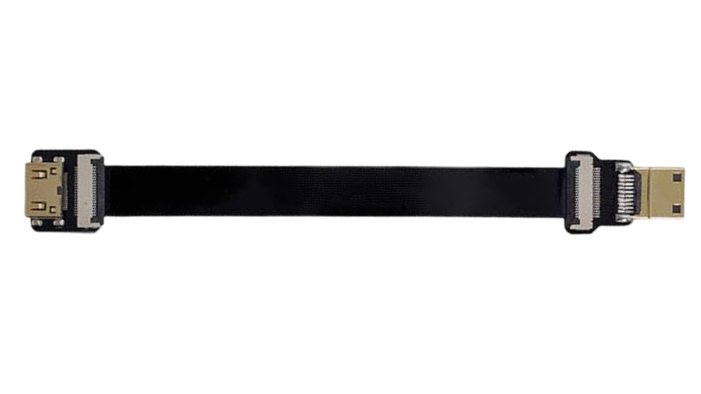
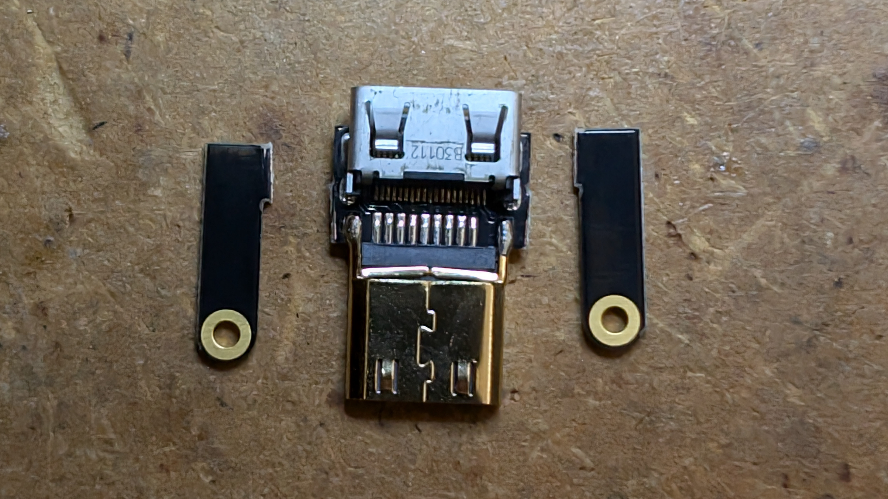
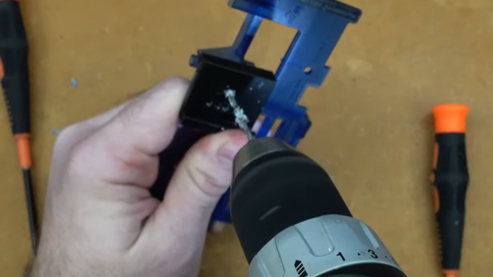
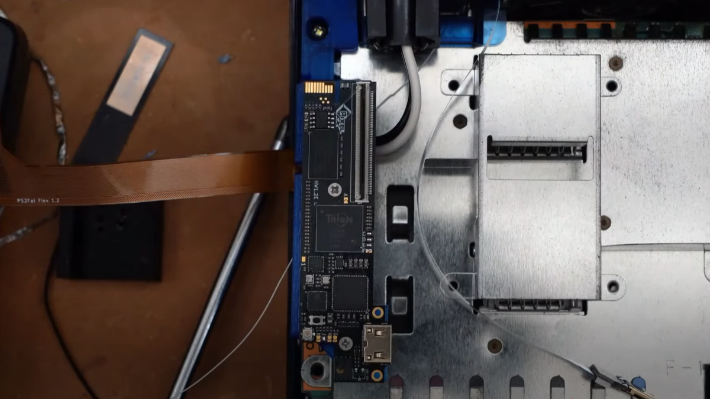
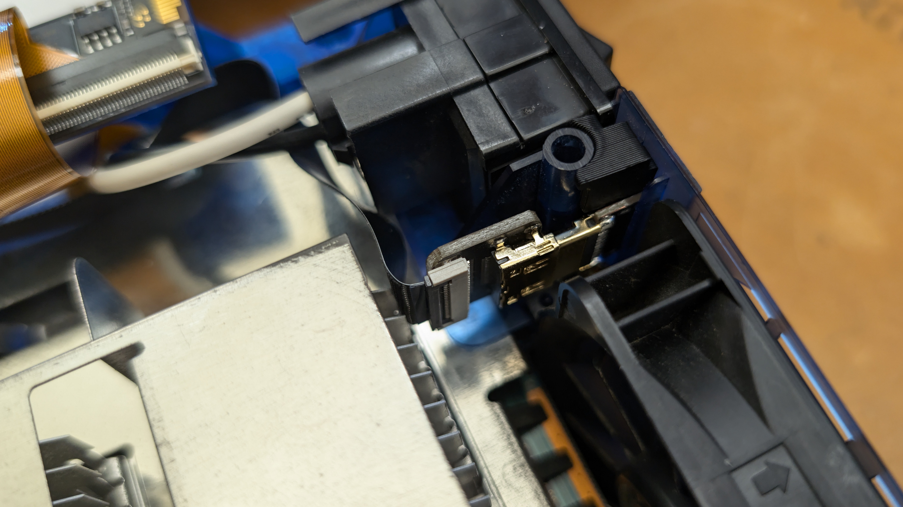
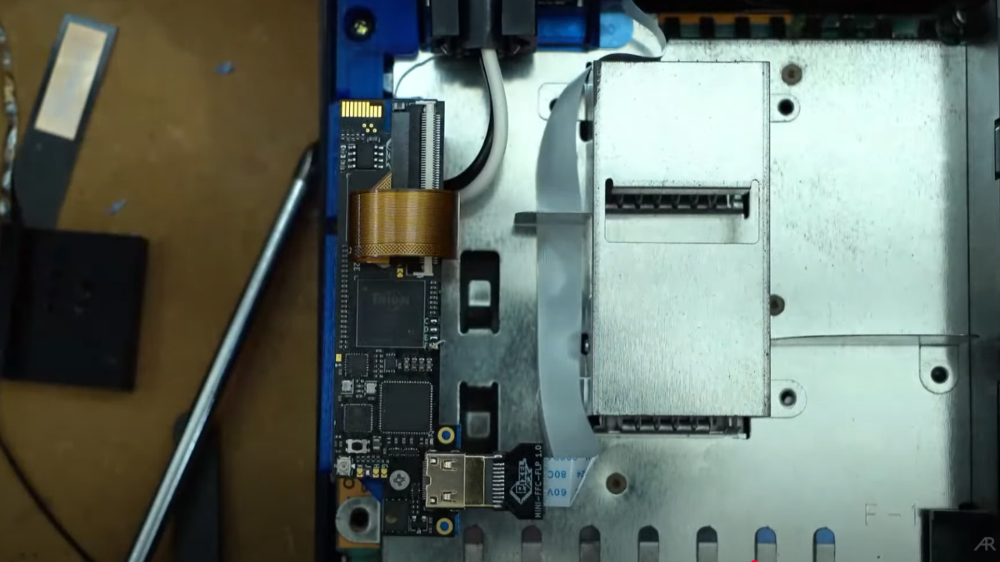

# PS2 FAT Retro GEM Relocation Kit

## Introdution

This is a 3D printable kit meant to relocate the Retro GEM to an alternate loacation on FAT PS2 models. This relocation allows you to install the GEM without removing the Toslink port, and for SCPH-30K series PS2s eliminates the need to swap the power supply with a 50K model.

## Parts

- **[Retro GEM Riser Mount:](./stl/Retro_GEM_PS2_Fat_Relocation_Riser.stl)**
This component is the mounting solution that moves the Retro GEM from the bottom of the motherboard, in the power supply region of the console, to the top of the motherboard in the heatsink region of the console.

- **[HDMI Port Locking Wedge:](./stl/Retro_GEM_PS2_Fat_Relocation_HDMI_Port_Locking_Wedge.stl)**
  This component is what physically secures the HDMI port in place on the back plate of the console. It is designed to friction fit in place and take the insertion force of the HDMI cable when it is plugged in. It indexes against the post next to the power input block and transfers the insertion force of the HDMI port into that post.

- **[HDMI Port Drilling Guide:](./stl/Retro_GEM_PS2_Fat_Relocation_HDMI_Drilling_Jig.stl)**
    This component is a sacrificial drilling guide that aides you in cutting the HDMI port accurately. It slides onto the rail on the PS2's backplate where the power input block normally resides, and aligns the drill holes correctly to cut the basic shape of the HDMI port before filing to final size.

- **HDMI Extension Cable:**
    This component is the only part that must be purchased separately. The HDMI extension is the component that moves the HDMI port from the Retro GEM to it's final mounting point on the backplate of the PS2. You have two options for the type of HDMI extension you use. 
	
	1.***[Generic Mini HDMI Extension Flex Cable:](https://a.co/d/anGFya6)***
	The linked cable is an example of a generic Mini HDMI Flex extension that will work with this relocation kit. There are many options identical to this one available across various marketplaces, so you can purchase whichever one is easiest to get in your area.
	

	
	2.***[PixelFX 79K HDMI Flex](https://www.pixelfx.co/product-page/ps2-slim-hdmi)***
	This flex cable is sold as part of the PS2 79K installation kit. To purchase this part you should select NO GEM, PS2 Slim 79K Kit, and NO extra cable. This will allow you to purchase only the 79k parts. 
	

## Install Instructions

Follow PixelFX's installation guide for your model of PS2 motherboard until you get to the point where they tell you to mount the PS2 GEM. At that point refer to the remainder of this guide for instruction.

- **Folding the Main Flex Cable:**
The main flex cable for the Retro GEM needs to be folded differently compared to the PixelFX instructions because the cable needs to exit the motherboard on the bottom side of the console rather than the rear. Fold the cable as shown in this reference image.

- **Bending the Metal Frame:**
There are ground contact points on the frame of the PS2 that make contact with the ground plane around the PS2 motherboard. You need to bend a couple of these out of the way of the flex cable so it doesn't pinch the flex cable between the motherboard and the frame.

- **(Optional) Modify HDMI C-FLP1 Board:**
If you are using the Generic HDMI extension cable instead of the PixelFX 79K Flex cable then you will need to modify the C-FLP1 board that was included with your Retro GEM install kit. All you need to do is clip the mounting ears off of the left and right sides of the C-FLP1 board.

- **Drilling the HDMI Port Holes:**
Slide the HDMI drilling guide onto the backplate of the PS2 with the 3 hole side facing the opening of the power input block. Drill the three holes using a 7/64" drill or a 1/8" drill. (WARNING if you use a 1/8" drill you can easily end up with an oversized HDMI port. Be very careful and take it slow!)Once you have drilled the 3 hole side of the guide, remove it, flip it over to the 2 hole side and drill the remaining 2 holes.

- **Filing the HDMI Port to Final Size:**
Now that you have drilled the rough outline of the HDMI port, use a small flat file to slowly enlarge the opening until the HDMI port from the extension cable fits through. Check the hole with the HDMI port often while you are filing to make sure you don't end up with an oversized hole for the HDMI port.

- **(Optional) Solder the SPDIF Wire:**
Before installing the backplate to the PS2 you should solder a wire to the pin of the Toslink port closest to the A/V Multi Out.

- **Mounting the GEM Riser:**
The riser for the Retro GEM installs in the location where the screw that holds the backplate to the bottom shell of the PS2 normally goes. Slide the riser into the screw boss, then install the screw to secure the riser and the backplate in place.

- **Mounting the GEM to the Riser:**
Now that the riser is installed you can mount the GEM to the riser using 2 M2 screws. Then fold the main flex cable **UNDER** the riser, and then over the top of the GEM board and lock it into the FFC connector. **MAKE SURE YOUR FLEX CABLE PASSES UNDER THE RISER, NOT OVER THE RISER. IF THE FLEX DOESN'T PASS UNDER THE RISER THEN IT WILL BE PINCHED AND DAMAGED BY THE PS2 TOP SHELL!!!** Also if you are installing the SPDIF wire go ahead and solder it now.

- **Mounting HDMI Port:**
Before you mount the HDMI port to the backplate, make sure that you install the screw for the exhaust fan. The screw cannot be installed after the HDMI port is mounted. 

***PixelFX 79k HDMI Flex:*** If you are usin the PixelFX 79K HDMI extension flex, then slide the HDMI extension port into the hole you cut on the backplate. Once the port is fully inserted then you can slide the HDMI port locking wedge between the post and the rear of the HDMI port.

***Generic HDMI Flex:*** If you are using the Generic HDMI Flex cable you should remove the breakaway piece from the HDMI wedge and then install the modified C-FLP1 board into the hole you cut on the backplate and install the wedge. After the C-FLP1 board is secured you can then mount the HDMI extension cable to the C-FLP1 board.

- **Connect the HDMI Extension Cable to the Retro GEM:**
Plug in the HDMI Extension cable and route it neatly around the heatsink.

- **Mount the Wi-Fi Antenna:**
Attach the wifi antenna to the GEM, and stick the antenna to the side of the optical drive housing.

- **Reassemble the Console and Bask in the Glory of your Creation!:**

**THIS STEP IS REQUIRED!**

